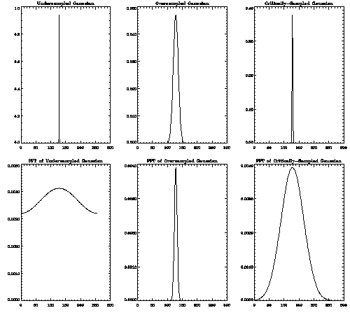



## Everything DSP

### Description

When I first set out to create an application which could Analyze or Edit Digital Sound Files. I spent 2-3 months searching for example code and Documented Material, on the Subject. I couldn't find any VB Code Examples ANYWHERE! I did however turn up a Text File which turned out to be a complete Road Map. I Don't Know where I picked this Document up from, but it was the Foundation of my Audio Projects. I've gotten a lot of Questions, about these projects, so I decided to share this document with anyone interested. It Covers alogrythms for FFT, FIR, IIR, Sampling, Downsampling, Interpolation, Bandpass, Amplitude modulation, Flange, Delay, Frequency shifting, Noise, Equalization, Harmonics, Pitch shifting(Wavetable synthesis), and Much, Much More! To see some of these alogrythms in action, then Check out my TrueWavAnalyzer & TrueWavEditor Projects listed here on PSC.
 
### More Info
 

             |
---                |---
**Submitted On**   |2002-02-08 09:59:30
**By**             |[Zaphod](https://github.com/Planet-Source-Code/PSCIndex/blob/master/ByAuthor/zaphod.md)
**Level**          |Advanced
**User Rating**    |5.0 (45 globes from 9 users)
**Compatibility**  |VB 5\.0, VB 6\.0
**Category**       |[Sound/MP3](https://github.com/Planet-Source-Code/PSCIndex/blob/master/ByCategory/sound-mp3__1-45.md)
**World**          |[Visual Basic](https://github.com/Planet-Source-Code/PSCIndex/blob/master/ByWorld/visual-basic.md)
**Archive File**   |[Everything53930282002\.zip](https://github.com/Planet-Source-Code/zaphod-everything-dsp__1-31607/archive/master.zip)

### Source Code

  <strong>This is written for the audio digital signal processing enthusiasts(as the title suggests) and others who need practical information on the Subject.  </strong>
In filter frequency response plots, linear frequency and magnitude scales are used.
Note that "sample" can mean (1) a sampled sound or (2) a samplepoint!  
Sampled sound data is a pile of samples, amplitude values taken from the actual sound wave. Sampling rate is the frequency of the "shots".  
For example, if the frequency is 44100, 44100 samples have been taken in one second.
A sampled sound can only represent frequencies up to half the samplerate. This is called the Nyquist frequency.  
If you try to include above Nyquist frequencies in your sampled sound, all you get is extra distortion as they appear as lower frequencies.
A Sound consists of frequency components. They all look exactly like sine waves, but they have different frequencies, phases and amplitudes (3 Dimensional).  
Here's the way to calculate the phase and the amplitude of the resulting sinewave... Convert the amplitude and phase into one complex number, where angle is the phase, and absolute value the amplitude. 
amplitude*e^(i*phase) = amplitude*cos(phase)+i*amplitude*sin(phase)  
If you do this with two sinewaves, you can add them together as complex numbers.  
When adding two sampled sounds together, you may actually wipe out some frequencies, those that had opposite phases and equal amplitudes. The average amplitude of the resulting sound is (for independent originals)   sqrt(a^2+b^2)   where a and b are the amplitudes of the original signals.  
The main use of a filter is to scale the amplitudes of the frequency components in a sound.  For example, a "lowpass filter" mutes all frequency components above the "cutoff frequency", in other words, multiplies the amplitudes by 0. It lets through all the frequencies below the cutoff frequency unattenuated.  
If you investigate the behaviour of a lowpass filter by driving various sinewaves of different frequencies through it, and measure the amplifications, you get the "magnitude frequency response". 
Filters never add any new frequency components to the sound. They can only scale the amplitudes of already existing frequencies.  For example, if you have a completely quiet sample, you can't get any sound out of it by filtering.   Also, if you have a sine wave sample and filter it, the result will still be the same sine wave, only maybe with different amplitude and phase - no other frequencies can appear.  
Professionals never get tired of reminding us how important it is not to forget the phase. The frequency components in a sound have their amplitudes and... phases. If we take a sine wave and a cosine wave, we see that they look alike, but they have a phase difference of pi/2, one fourth of a full cycle. Also, when you play them, they sound alike.   But, try wearing a headset and play the sinewave on the left channel and the cosine wave on the right channel. Now you hear the difference!  
Phase itself doesn't contain important information for us so it's not heard, but the phase difference, of a frequency, between the two ears can be used in estimating the position of the origin of the sound, so it's heard.
   
<strong>(SEE COMPLETE DOCUMENT IN ZIP FILE)</strong>

